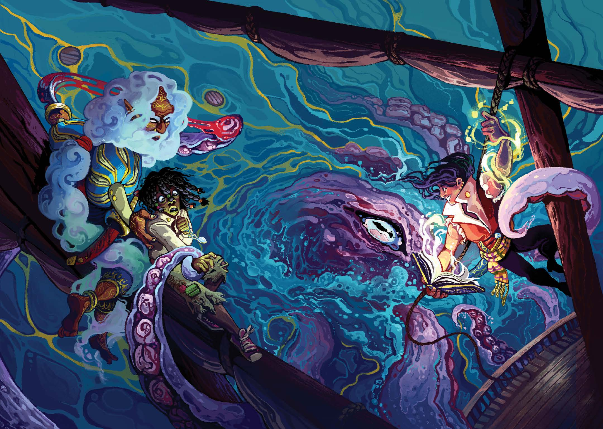
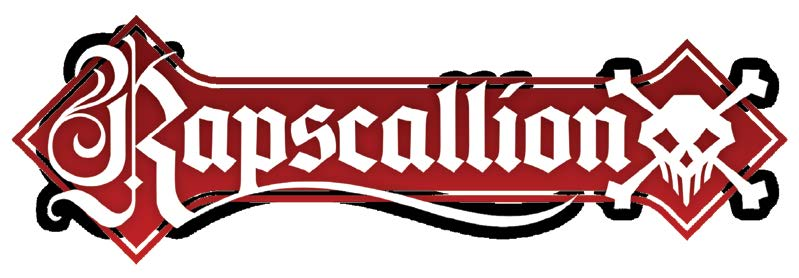
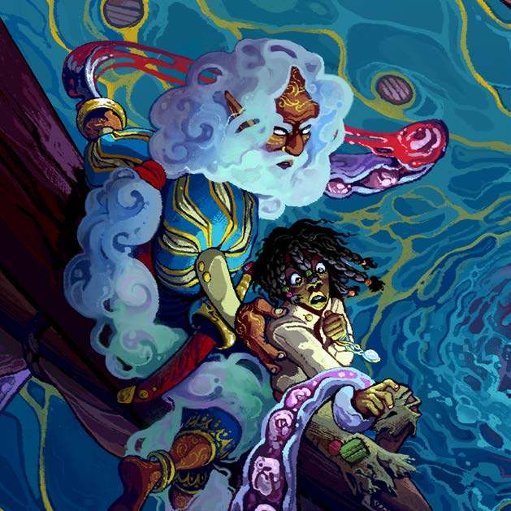
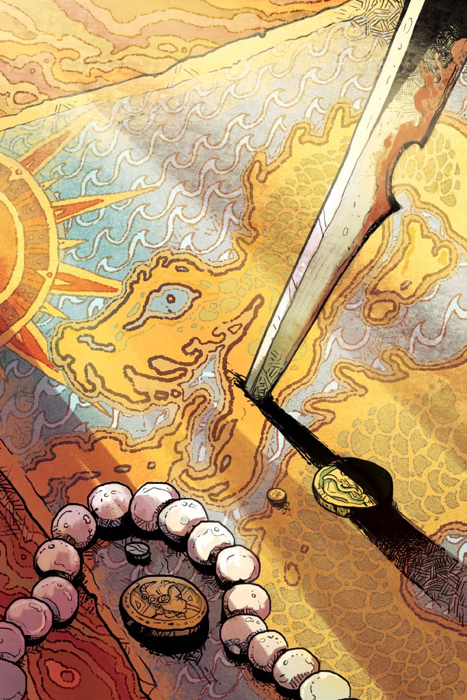

Daniel Huang (Order #51144624)

Players3-6Time2-4 hrsRatingTeenThe Great Sea Awaits!Rapscallion is a roleplaying game that plunges you and your friends into the waters of the Great Sea, churning with danger and wonder! The call of treasures unknown is too great for you and your crew of misfits to ignore. Board your ship with your steadfast crewmates and set sail across the unknown to secure your legacy and might.In Rapscallion, you might duel atop heaving ship decks, commit dark deeds to protect those you care about most,  but you cannot escape the vices that haunt you along the way! Play as a haunted captain possessed by a thousand vengeful ghosts, a bound djinni trapped within a magical book, a dark sea-sorcerer who made a deal with a demon for power, or a mysterious navigator who stole the heart of the ocean itself. You’ve only got your ship and your crew to rely on, in this world of a thousand enemies... Can your stories match the strangeness of the Great Sea herself? ŠEasy-to-follow rules for all manner of swashbuckling adventure and tools for creating your own version of the Great Sea. Š10 unique character playbooks and three unique ship playbooks to create your roguish crew of pirates! ŠExciting troubles and vices that compel you to follow the story to dramatic plotlines shrouded in mystery, secrets, and most importantly—adventure. ŠDetailed information on how to run Rapscallion from narrating ship combats to colliding with the demands of other seafaring factions along the way: the Law, the Free, and the Weird.Weigh anchor and make way! In the name of freedom, family, adventure, and most importantly—treasure!CORE RULEBOOKCORE RULEBOOKA SWASHBUCKLING ROLEPLAYING GAME

Daniel Huang (Order #51144624)

Daniel Huang (Order #51144624)

Project Manager: Elizabeth ChaipraditkulLead Designer: WhistlerContributing Designer: Mark Diaz TrumanLead Writer: WhistlerContributing Writers: Elizabeth Chaipraditkul, Brendan G. Conway,  Mark Diaz TrumanDevelopmental Editing: Brendan G. Conway & Mark Diaz TrumanCopy Editing: Monte LinProofreading: Katherine FackrellIndexing: J. Derrick KapchinskyArt Direction: Marissa KellyArt: WhistlerLayout & Graphic Design: Miguel Ángel EspinozaAdditional Layout: Valerie Osbourn & Elizabeth ChaipraditkulStaff Support: Kate Bullock, Christi Cardenas, Meg Creaturo Anaya, Coyote Crow  J. Derrick Kapchinsky, Adam McEwen, Adriana Monroy, Valerie Osbourn, Lili Sparx Rapscallion text and design © 2024 Magpie Games. All rights reserved.The mechanics of Rapscallion are based on the Powered by the Apocalypse framework originally developed by Meguey and Vincent Baker of Lumpley Games; you can find more of their work at lumpley.games. The mechanics for ship advancement were inspired by character advancement in Miseries & Misfortunes by Luke Crane; you can find more of his work at burningwheel.com. A special thanks  to our amazing Kickstarter backers who made this possible!Printed by Game Beings. First printing 2024.

Daniel Huang (Order #51144624)

CONTENTSWhat is This Game ......................5What is a Tabletop Roleplaying Game?  ...5The World of Pirates ..................................7Safety Tools  ...............................................8What You Need to Play ............................11The World of Rapscallion ............13The Great Sea ...........................................13The Powers of the World .........................16Sea Magic ..................................................22The Crew  .................................................27The Fundamentals .....................29The Conversation .....................................29Framing Scenes ........................................30Fictional Positioning  ................................32Moves & Dice............................................33Core Elements  .........................................36Ships & Plunder ........................................43Non-Player Characters.............................51Crafting Your World ..................59Starting A Game  ......................................59Touching on Reality  ................................60Introducing the Map ................................64Crafting the Ship ......................................65Drawing on the Map  ...............................72The Anatomy of a Scoundrel ......75Who Are You?  ..........................................75Choosing Playbooks  ................................76Choosing Oddities  ...................................81Selecting Playbook Moves  ......................83Picking a Kit  .............................................84Choosing Your Name & Look ..................85Answering Questions  ..............................86Moves .......................................89Basic Moves ..............................................89Special Moves .........................................104Ship Moves .............................................108Downtime Moves ...................................113Playbooks ................................121Pirate Playbooks .....................................121Pirate PlaybooksThe Captain .........................................122The Chirurgeon ...................................126The Chronicler .....................................130The Gunslinger ....................................134The Matelot .........................................138The Mountebank .................................142The Navigator ......................................146The Shiprat ..........................................150The Swashbuckler ...............................154Ship PlaybooksThe Jewel .............................................158The Legend ..........................................162The Ramshackle ..................................166The Horizon .............................171The Shape of Adventures ......................171Character Advancement .......................177Ship Advancement .................................183The Role of the Fates ...............189Responsibilities .......................................190The Agendas  .........................................192The Compass Points ..............................194Fate Moves  ............................................198Playbooks in Play ....................................207Preparing for Your Game .......................219The World Toolbox ..................225The Map ..................................................225Faction Codex  .......................................234The Queen’s Company ........................235The Lace Empire  .................................238The Guild of Inks .................................241The Royal Navy ....................................244The 7 Pirate Lords ...............................247The Rat Legion ....................................253The Witches of Osgrim .......................256Virgil’s Army .........................................259Telling the Tale........................263Anatomy of an Adventure  ....................264First Adventures .....................................272Appendix ..................................28

Daniel Huang (Order #51144624)

4 RAPSCALLION – PReFACe

